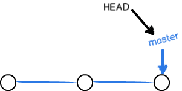

# git基础

> git的使用流程

1. 创建版本库

   ```shell
   cd $workdir
   git init
   ```

2. 配置个人信息

   ```shell
   #增加个人配置信息的方法有三种
   ##1.增加个人全局配置，这个是最常用的方法。它会将配置增加在个人家目录的.gitconfig文件里。
   git config --global user.name "Dr.Z"
   git config --global user.email "zhoushengrui@qq.com"
   ##2.增加git库层面配置。它会写入当前git库目录的.git/config文件里，只在当前git库生效，具备最高优先级。
   git config user.name "Dr.Z"
   git config user.email "houshengrui@qq.com"
   ##3.增加系统层面git库配置，这个不太常用。这个机器上的所有用户都使用同一个git账号，写入/etc/gitconfig中。
   git config --system user.name "Dr.Z"
   git config --system user.email "zhoushengrui@qq.com"
   ```

   当我们使用git config --list查看到自己当前的配置信息了，如何确定自己配置信息的位置呢？

   ```shell
   git config --list --show-origin
   ```

   

3. 增加文件

```shell
#当文件放入$workdir后，比如readme.txt
git add readme.txt
```

4. 提交更改

```shell
git commit -m "What has i done"
```

以上是本地使用git的基本步骤，非常简单。但是我们在本地使用意义不大，更重要的是与git远程仓库进行同步。两种方法：

1. 直接将远程仓库克隆下来到本地。

   ```shell
   git clone https://gitee.com/Dr-Z/learning-notes.git
   #此时本地已经有learning-notes目录，已经拿到了所有内容。即便已经拿到所有信息，如果没有配置好git config --global或者git config --system，那么还是需要提前配置git的user.name和user.email。
   git config --global user.user "test"
   git config --global user.email "test@163.com"
   
   #上面配置完成后，就可以做本地的更改了，当更改结束后。
   git add * #不建议如此，修改了什么文件就add什么文件比较好。
   git commit -m "My commit"
   git push 
   即可，这样是比较方便的。
   
   ```

   

2. 配置本地仓库后，git pull保证和远程仓库的同步。

   ```shell
   mkdir mynotes
   git init
   #假定已经在全局配置了user.name和user.email。
   git remote add origin https://gitee.com/Dr-Z/learning-notes
   
   #目前思路里，下面只有两种做法
   1. git pull
   #在空仓库的情况下这里会报个错，
   There is no tracking information for the current branch.
   Please specify which branch you want to merge with.
   See git-pull(1) for details.
   
       git pull <remote> <branch>
   
   If you wish to set tracking information for this branch you can do so with:
   
       git branch --set-upstream-to=origin/<branch> master
   
   #其实代码已经拉到本地，branch为remotes/origin/master，只不过当前本地没有master，也无法将本地与remotes的这个branch关联起来。工作分支并不在origin/master上，无法看到origin/master的内容。
   git checkout master
   #切换到远程分支即可。
   2.git fetch
   #和git pull的应对过程一样，但是真正的执行过程不同。git pull会拉取所有分支，而fetch只会拉取master分支。
   
   #这两种形式查看git branch -a分支情况，本地都只有remotes/origin/master一个分支。
   3.git pull orgin master
   #这种方式将自动在本地创建master分支，git branch -a看到的是两个分支。此时直接就能看到pull下来的代码。
   zhou@zhou:~/mytest/git4/notes$ git branch -a
   * master
     remotes/origin/master
   
   
   #但是这还没完，本地的master和origin/master并没有关联，
   git --set-upstream-to=orgin/master master
   #这样就完成了关联，git push即可默认提交上去。
   
   
   ```

> git 基础操作

## 状态查看

1. git status

   当对工作目录做了修改之后，使用git status可以查看到git监控到的修改内容

   ```shell
   zhou@zhou:~/mytest/git4/git5$ git status
   On branch master
   Changes not staged for commit:
     (use "git add <file>..." to update what will be committed)
     (use "git checkout -- <file>..." to discard changes in working directory)
   
           modified:   readme.txt
   
   no changes added to commit (use "git add" and/or "git commit -a")
   
   ```

2. git diff

   这个时候还没有执行git add，使用git diff将显示出当前目录中文件的修改部分。

   ```shell
   zhou@zhou:~/mytest/git4/git5$ git diff
   diff --git a/readme.txt b/readme.txt
   index 01e79c3..94ebaf9 100644
   --- a/readme.txt
   +++ b/readme.txt
   @@ -1,3 +1,4 @@
    1
    2
    3
   +4
   
   ```

   * git diff ：默认对工作区和暂存区(stage)进行对比。如果已经git add了，那么git diff不带参数的情况下将无法对比出任何结果。

   * git diff --cached或者git diff --staged：对比暂存区和commit文件的不同，后面可以跟上具体的commit，如果不写commit，将会对比当前HEAD。

   * git diff HEAD：直接对比工作区和版本库分支里的的文件不同。
   * git diff <commimt1> < commit2>：对比两次commmit的不同。
   * git diff HEAD -- readme.txt：这里的--是什么意思？

3. git log

   查看当前commit的位置以及commit的提交记录。

## 版本回退

1. 当我们修改了工作区文件，然后git add +git commit提交后，想回退。

   ```shell
   git reset --hard HEAD^ #HEAD^是指当前HEAD指向的前一次commit，HEAD^^是前两次。
   
   #也可以根据commit id来做。
   git log #找到想要回退的commit id
   git reset --hard <commit id>
   
   #以上是整个工作区的回退，如果只是想回退指定文件
   git reset HEAD^ readme.txt  ##这个操作只会从分支恢复到stage暂存区。
   git checkout -- readme.txt ##将文件从stage暂存区检出到工作区即可。
   
   ```

2. 如果我们只是修改了工作区的文件，然后执行了git add却没有git commit提交，想回退。

   ```shell
   git restore readme.txt ##这条命令在新版本被废弃了，使用第一条命令来做。
   ```

3. 如果我们只是修改了工作区的文件，并没有git add，需要回退

   ```shell
   git checkout -- readme.txt
   ```

   

## 误回退的修复办法

误回退后，git log就看不到之前提交的commit id了，也就无法使用git reset --hard。虽然git log看不到，但是git reflog可以看到。。

```shell
git reflog
zhou@zhou:~/mytest/git4/git5$ git reflog
558de4d (HEAD -> master) HEAD@{0}: commit: 4
20662f8 HEAD@{1}: commit: 3
31eed89 HEAD@{2}: commit: 2
4ae95c9 HEAD@{3}: commit (initial): 1
#根据自己的commit找到对应的commit it，用git reset --hard还原即可。
```

## 文件删除

当使用rm删除了工作区的文件之后，git会监控到这个更改。如果确定要删除这个文件：

```shell
git rm test.xt
```

如果只是误操作：

```shell
git checkout -- test.txt
```


> git 基本原理

git有工作区和版本库的概念。

* git init或者git clone下来的那个目录便是**工作区**，它是在电脑里能够看到的目录。

* **版本库**，在工作区有个隐藏目录.git，它已经不属于工作区了，而是Git的版本库。版本库里有很多东西，其中最重要的是stage(也叫index)的暂存区，还有Git为我们自动创建的第一个分支Master以及指向Master的一个指针HEAD

 

所以我们在往版本库提交内容时是分两步执行的

* 第一步，git add 将修改添加到stage暂存区

* 第二步，git commit提交更改，就是把暂存区的所有更改提交到当前分支。一旦提交之后，stage分区又变成clean了。


这里就存在一个疑问了，stage区域里面难道存放的只是变更？那git diff怎么工作的？按照git的理论，Git只是关注变更，再结合层的概念，也就是说其实stage暂存区域存放的是一层修改，commit的时候提交的也是一层修改，分支里其实是一层又一层的叠加。那，git diff又是怎么工作的呢？

git在add和commit时会有一个压缩的动作，之前在测试时，使用dd从/dev/zero生成一个100M的文件，在git add和git commit后大小增加并不明显，但是从/dev/urandom读取随机的100M后，git add就变成了200M，但是git commit后并没有再增大。说明git仓库存一份，工作目录存一份，暂存区里并不存放文件，存放的应该是变动的那一层。git diff用了一种巧妙的方法，也可能是比较low的方法来进行了一场对比。   

## git 分支

> 分支创建与合并

在版本回退里，已经知道每次提交，git都会把他们串成一条时间线，这条时间线其实就是一个分支。更确切来说，是一条层逐步叠加的线，而每个分支都是一个指针，指向这多个层中的某一层。到目前位为止，我们只有一个指针，主分支master。HEAD严格来说并不是指向每次提交，而是指向某个指针，HEAD指针算是一个标记，标记着当前的提交会提交到哪个指针指向的层上面。

一开始的时候，只有一个master指针，Git用master指针指向了最新的层，再用HEAD指向master，就能确定当前分支以及当前分支的提交点：



随着每一层的提交，master都会指向最新的层，这样随着不断的提交，层累积的也就越来越多。当我们创建一个新分支的时候，例如dev，git创建一个新的指针叫做dev，它在初始创建时与master一起指向同一个层，然后我们就可以控制HEAD的指向了。HEAD指向master，便是使用master分支，HEAD指向dev便是使用dev分支。


Git创建分支很快，因为只是增加了一个指针而已，工作区文件都没有任何的变化。当我们把HEAD指针指向dev后，那么提交就是针对dev指向的这一层了。比如新提交一次后，dev指针指向新提交的这一层，而master指针指向的层并没有变化。


当我们在dev分支上的工作完成后，就可以把dev合并到master分支上了，其实也就是把master的指针指向了dev所在的那一层

合并完成之后，我们就可以删除dev分支了，此时便只留有master分支


下面看一下分支用到的命令：
```shell
kali@kali:~/test$ git checkout -b mdev
Switched to a new branch 'mdev'
```
gitcheckout 加上-b参数标识创建并切换，相当于一下两条命令：
```shell
git branch mdev
git chekout mdev
```
查看当前存在的所有分支：
```shell
git branch -a
*mdev
master
```
然后后面我们所有的提交都是指向dev指针所在的层，在提交之后，dev会指向最新提交的层，但是master并不会变动。当我们切换到master分之后，最新的提交层就不会体现出来了。
```shell
git checkout master
```

现在把dev分支合并到master分支上：
```shell
git checkout master
git merge dev
```
git merge的命令用于合并指定分支到当前分支，合并后就再可以看到在dev层进行的提交了。这种合并方式非常快，因为只是修改了指针的指向，被称为fast-forwad。但是并不是每次都能fastforward，比如master分支在dev被修改时也被修改了。这个后面讲述。

合并完成后，就可以放心的删除dev分支了：
```shell
git branch -d dev
```
删除后再查看branch，就只剩下master分支了：
```shell
git branch -a
*master
```
切换分支除了使用git checkout，在新版本中还可以使用git switch
```shell
#创建并切换到新的分支
git switch -c dev
#切换到已有分支
git switch master
```
