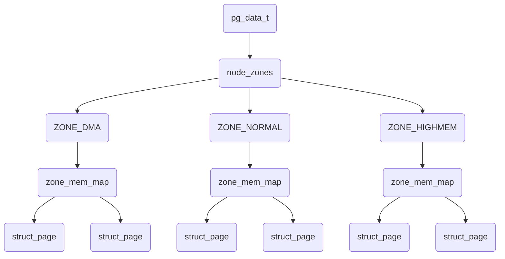

要死一样的Linux虚拟内存管理部分要开始了，我打算在半年内学完这个东西。。。我都不敢做计划了。这部分涉及太多太多的名词，函数，我的天，太难了。不多说了，开始吧，不学这个东西，永远达不到我想要的那个层次。


# 第二章 描述物理内存

前言部分就看的我一愣一愣的，这特么，概念太多了。

NUMA：非一致性内存访问。对于大型机器而言，内存会分为很多簇，依据这些簇和处理器距离的不同，访问不同的簇会有不同的代价。比如，可能把内存的一个簇指派给一个处理器，或者某个簇在物理设计上和某个设备卡很近，很适合内存直接访问（DMA），那么就指派给该设备。比如，在我当前用到的服务器上，NUMA结构如下：

```shell
zhoushengrui@crystal ~% numactl -H
available: 4 nodes (0-3)
node 0 cpus: 0 1 2 3 4 5 6 7 8 9 10 11 12 13 14 15 16 17 18 19 20 21 22 23 24 25 26 27 28 29 30 31
node 0 size: 257673 MB
node 0 free: 193895 MB
node 1 cpus: 32 33 34 35 36 37 38 39 40 41 42 43 44 45 46 47 48 49 50 51 52 53 54 55 56 57 58 59 60 61 62 63
node 1 size: 258043 MB
node 1 free: 208835 MB
node 2 cpus: 64 65 66 67 68 69 70 71 72 73 74 75 76 77 78 79 80 81 82 83 84 85 86 87 88 89 90 91 92 93 94 95
node 2 size: 193531 MB
node 2 free: 133596 MB
node 3 cpus: 96 97 98 99 100 101 102 103 104 105 106 107 108 109 110 111 112 113 114 115 116 117 118 119 120 121 122 123 124 125 126 127
node 3 size: 256119 MB
node 3 free: 201516 MB
node distances:
node   0   1   2   3
  0:  10  16  32  33
  1:  16  10  25  32
  2:  32  25  10  16
  3:  33  32  16  10

```

当前机器CPU的物理情况：（也就是说当前CPU是双路128核的cpu？）

```shell
zhoushengrui@crystal ~% lscpu
Architecture:                    aarch64  #架构
CPU op-mode(s):                  64-bit
Byte Order:                      Little Endian
CPU(s):                          128  #逻辑cpu的数量
On-line CPU(s) list:             0-127
Thread(s) per core:              1
Core(s) per socket:              64  #每个CPU插槽的核心数
Socket(s):                       2  #CPU插槽数。
NUMA node(s):                    4
Vendor ID:                       HiSilicon
Model:                           0
Model name:                      Kunpeng-920
Stepping:                        0x1
Frequency boost:                 disabled
CPU max MHz:                     2600.0000
CPU min MHz:                     200.0000
BogoMIPS:                        200.00
L1d cache:                       8 MiB  #一级数据缓存
L1i cache:                       8 MiB  #一级指令缓存
L2 cache:                        64 MiB  #二级缓存
L3 cache:                        256 MiB  #三级缓存
NUMA node0 CPU(s):               0-31
NUMA node1 CPU(s):               32-63
NUMA node2 CPU(s):               64-95
NUMA node3 CPU(s):               96-127
Vulnerability Itlb multihit:     Not affected
Vulnerability L1tf:              Not affected
Vulnerability Mds:               Not affected
Vulnerability Meltdown:          Not affected
Vulnerability Spec store bypass: Vulnerable
Vulnerability Spectre v1:        Mitigation; __user pointer sanitization
Vulnerability Spectre v2:        Not affected
Vulnerability Srbds:             Not affected
Vulnerability Tsx async abort:   Not affected
Flags:                           fp asimd evtstrm aes pmull sha1 sha2 crc32 atomics fphp asimdhp
                                  cpuid asimdrdm jscvt fcma dcpop asimddp asimdfhm

```

NUMA讲起来又是一本书啊。。。这里先不深入研究了吧，只需要知道numa是将内存划分了区片，每个numa节点分配一亩三分地。NUMA节点不一定和cpu插槽数一致，也就是说不一定有两个cpu就有两个numa节点，可能是4个，比如上面。


好了，继续进行。上面说到一个簇可能指派个一个处理。这个簇，被认为是一个节点。到了这里

**簇=节点**

在Linux中，使用pg_data_t这个结构体（struct pglist_data）来指代一个节点。到了这里：

**簇=节点=pg_data_t**

系统中的每个节点，链接到一个以NULL结尾的pgdat_list链表中，而其中的每个节点利用pg_data_t->node_next字段链接到下一个节点。

**这里就懵逼了，首先可以知道：**

​	**簇=节点=pg_data_t----链接到---->pgdat_list(这个List以NULL结尾)**

**然后出现了一个名字叫做pg_data_t->node_next的字段，它链接到下一个节点。。。。这里节点是啥意思？是链表的一个节点还是一个簇？？？**

难道是这样的？

pg_data_t----链接到---->pgdat_lit

​    |

​	|-----它有个pg_data_t->node_next字段----链接到---->下一个节点？


我的妈，太难了。

翻译里是错的，pg_data_t->node_next字段，干，不是pg_data_tnode_next这个玩意。


每一个node都被分为了多个被成为管理区（zone）的块，用户表示内存的范围。

```
bank=node->pg_data_t=(a number of zones)
```

以上就算是内存宏观的结构了，从物理内存到Linux操作系统层面的映射完成。下面就可以针对zones来进行操作了。

​																		|->ZONE_DMA

zone->struct zone_struct([^zone_t])--|->ZONE_NORMAL

​																		|->ZONE_HIGHMEM.


ZONE_DMA: memory in the lower physical memory ranges certain Industry Standard Architecture([^ISA]) devices reqire.

ZONE_NORMAL:directly mapped by the kernel into the upper region of the [^linear address space.]

ZONE_HIGHMEM:remaining available memory in the system,not directly mapped by the kernel.

现在内核好像不是这么分了，我看到内核里有DMA DMA32 Normal以及什么Movable

With the X86,the zones are the follows:

ZONE_DMA				First 16Mib of memory

ZONE_NORMAL	  16MiB-896MiB

ZONE_HIGHMEM	896MiB-END


Many kernel operations can only take placing using ZONE_NORMAL,so it is the most performance-critical zone.The system's memory is comprised of fixed-size chunks call *page frames*.

Each physical page frame is represented by a **struct page**,and all the structs are kept in a global **mem_map** array,which is usually stored at the begging of ZONE_NORMAL or just after the area reserved for the loaded kernel image in low memory machines. 



## 2.1 Nodes和Zones

内存空间中的每个node都是有pg_data_t这个结构pglist_data类型的结构体来描述。当分配内存时，Linux使用*node-local allocation policy*从距离cpu最近的node分配内存。

```c
typdef struct pglist_data{
   zone_t node_zones[MAX_NR_ZONES];
   zonelist_t node_zonelist[GFP_ZONEMASK+1];
   int nr_zones;
   struct page *node_mem_map;
   unsinged long *valid_addr_bitmap;
    struct bootmem_data *bdata;
    unsigned long node_start_paddr;
    unsigned long node_start_mapnr;
    unsigned long node_size;
    int node_id;
    struct pglist_data *node_next;
} pgdata_t;
```

这个结构体描述了整个node的信息。

zones由一个zone_t结构体(struct zone_struct)来描述

```c
typedef struct zone_struct {
    spinlock_t lock;
    unsigned long free_pages;
    unsigned long pages_min,pages_low,pages_high;
    int need_balance;
    
    free_area_t free_area[MAX_ORDER];
    
    wait_queue_head_t * wait_table;
    unsigned long wait_table_size;
    unsigned long wait_table_shift;
    
    struct pglist_data *zone_pgdat;
    struct page *zone_mem_map;
    unsigned long zone_start_paddr;
    unsigned long zone_start_mapnr;
    
    char *name;
    unsigned long size;
  } zone_t;
```

这个数据结构描述了zone的信息，其中常见的free_pages，以及三条water_mark。当need_balance被置位的时候，也就是free_pages低于某条watermark了，系统会告知kswapd来回收内存。


**pages_low**：when the **pages_low**number of free pages is reached,**kswapd** is woken up by the buddy allocator to start freeing pages.

**pages_min**: When **pages_min** is reached,the allocator will do the **kswapd** work in a synchronous fashion(同步方式),sometimes referred to as the *direct-recalim* path.

**pages_high**:after **kswapd** has ben woken to start freeing pages,it will not consider the zone to ben "balanced" when **pages_high** pages are free.After the watermark has been reached ,**kswapd** will go back to sleep.

这是一个常规的kswapd工作方式。在2.6以后的内核中，如果在调用kswapd时带有nr_pages，那么kswapd不会在释放内存页到pages_high，而是到nr_pages和MAX_CLUSTER_MAX * 8的一个最小值。我不知道这个MAX_CLUSTER_MAX是个什么东西。


[^linear address space.]: 一直说线性地址空间。。指的是什么。
[^ISA]:ISA具体指代的是哪些设备？
[^zone_t]:这个东西是怎么定义的？说是用zone_struct来定义的，难道是用这个结构体定义的一个实例？可以这么说的吗？

