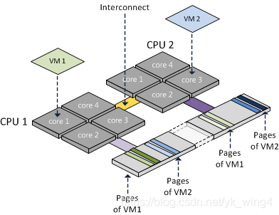
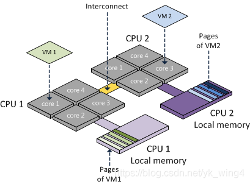

# 1、基础概念

* socket：cpu插槽数
* core：每个CPU的物理核数
* processor：每个核的线程数

> SMP和UMA

​	SMP将多个CPU插槽和一个集中的存储器相连，在SMP下，所有CPU都可以访问相同的地址空间，SMP系统有时候也被称为UMA（一致存储器访问）结构体系。



```
随着CPU插槽的增加，共享内存可能会导致内存访问冲突越来越厉害，当达到瓶颈时，增加CPU核的数量将无法再提高性能。SMP服务器CPU利用率最好的情况一般是2~4个插槽
```


> NUMA 

​	CPU插槽和直连的内存块结合起来，称之为一个NUMA code



* NUMA distance

  distance为各个NUMA node之间调用资源的开销。

  ```
  使用numactl --hardware可以打印distance
  ```

* socket间的连接和内存访问

  1. inter-connect

     ```
     socket间的连接称为inter-connet
     ```

  2. local-access

     ```
     cpu访问本node的内存时，称为local access。由于同一node内cpu和内存的物理距离最短，local access有最短的响应时间。
     ```

  3. remote-access

     ```
     cpu访问其他node的内存时称为remote access。此时要走inter-connect通道，remote-access的响应时间比较慢。
     ```

  remote-access比local access慢是由于电路板物理结构决定的，当需要跨node时候，就会相对变慢。

  > BIOS层和OS层 NUMA的相互关系

  1. 在BIOS层开启NUMA后，如果OS层的NUMA关闭，性能会有所下降
  2. 如果BIOS层关闭NUMA，无论OS层的NUMA是否打开，都不影响性能。

OS层面的NUMA可能导致SWAP占用，内存直接回收等问题，影响性能。如果内存比较紧张，业务使用内存较大，建议关闭NUMA，具体操作思路：

* 考虑从BIOS层面关闭NUMA
* 考虑从OS层面关闭NUMA
* 设置NUMA内存的分配策略为interleave=all
* 设置 内核参数vm.zone_reclaim_mode=0

# 2、工具使用

> BIOS层的NUMA设置

**查看BIOS层面是否开启NUMA**

```shell
$ grep -i numa /var/log/dmesg
$ dmesg|grep -i numa
1.如果显示No NUMA，说明NUMA在BIOS层面被disable
zhou@zhou:~$ dmesg |grep -i numa
[    0.000000] No NUMA configuration found
2.其他的情况说明NUMA开启。
```

<u>这里其实存在一个问题，如果在dmesg中没有搜索到任何与numa相关的信息呢</u>


> 修改BIOS的 interleave

BIOS种类繁多，一般都是自家自定的，不过大概意思就是：

 ```
BIOS:interleave
设定值：Enable  Disable
 ```


>OS层的NUMA配置

1. 查询当前内核启动参数

```shell
cat /proc/cmdline
```

2. 修改内核启动参数

```shell
vim /etc/grub.conf
修改kernel或者linuxe或linuxefi行
	增加‘numa=off’，关闭numa
	增加‘numa=on’，开启numa
```

3. numa管理工具numactl的使用

```shell
这个工具可以管理numa的分配细节，这里先不研究那么深入。只要知道：
numactl --hardware
numactl --show
这两个就可以了。

查看当前系统的numa命中情况可以使用numastat
zhoushengrui@crystal ~% numastat
                           node0           node1           node2           node3
numa_hit              1598779339       880838935      1224528739       477457292
numa_miss                      0               0               0               0
numa_foreign                   0               0               0               0
interleave_hit             31501           31392           31530           31375
local_node            1598049717       880715261      1224370352       477303407
other_node                729622          123674          158387          153885

如果numa_miss过高，可能需要调整了numa的策略了。
```

numactl可以将进程绑定到指定cpu上运行，而taskset也可以实现。不过要注意，taskset不能操作内存，在numa架构下，这样是有缺陷的。所以，UMA下可以使用taskset，NUMA下使用numactl。


