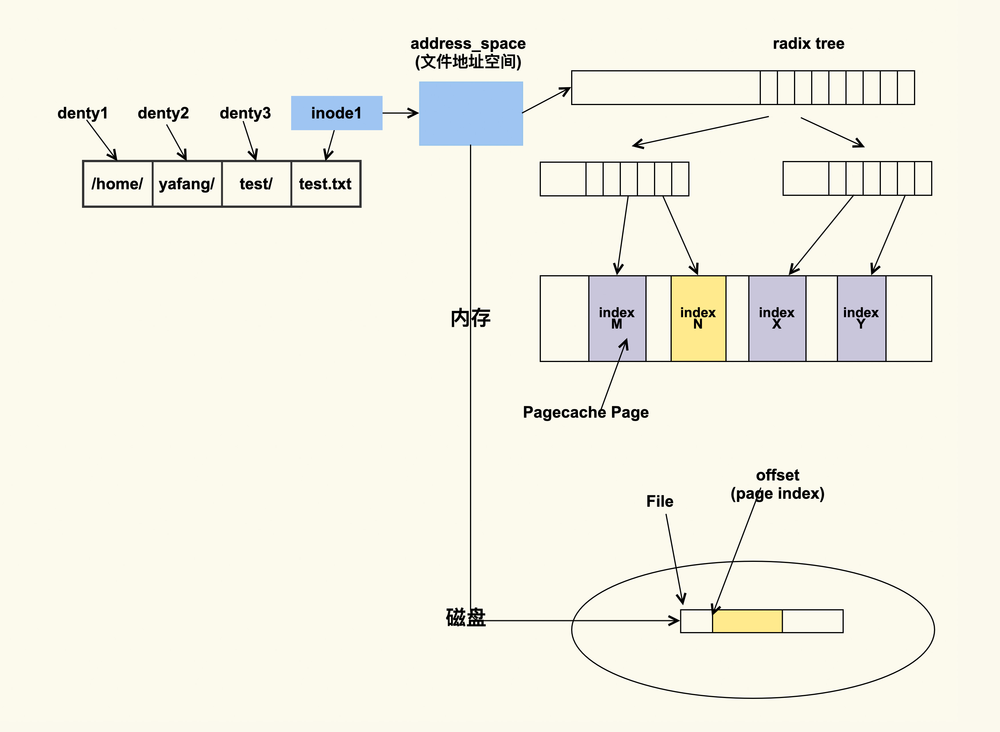

# 一、Linux PageCache问题处理

 ## 1.4pagecache容易回收引起的业务性能问题

通过前面的学习我们知道，Page Cache难以回收导致load飚高问题，这类问题经常会遇到。但是相反的，pageCache太过容易回收也会导致一些问题。

这类问题大致可以分为两个方面：

- 误操作导致PageCache被回收到，进而导致业务性能下降。
- 内核的一些机制导致业务PageCache被回收，从而引起性能下降。

如果业务对于PageCache非常敏感，或者业务数据对于延迟很敏感，再具体点，业务指标对于TP99非常敏感，那么PageCache释放导致的性能问题就要关注了。

### 1.4.1对Page Cache操作不当产生的业务性能下降问题

我们平时在清理Page Cache时，会通过drop_cache来清理。但是这样做会有一些负面影响，比如说PageCache被清理掉后产生的性能下降问题。为什么会这样？

这里就要说一下inode了，这里说的inode和ext分区中的inode是不同的。这里的inode指的是内存中对磁盘文件的索引，进程在查找或者读取文件时就是通过inode来操作的。观察下面一张图（这张图的内容有错误，不是denty，而是dentry）。



 [^ 这一段内容我不太懂，感觉不太理解]

如上图所示，进程会通过inode在找到文件的地址空间(address_space)，然后结合文件偏移（会转换成page index）来找具体的page。如果该page存在，说明文件内容已经读取到了内存；如果该page不存在，说明内容并不在内存中，需要到磁盘中去读取。可以理解为inode是PageCache page（页缓存页）的宿主（host），如果inode不存在了，那么pagecache page也就不存在了。

如果使用drop_cache来释放inode的话，应该清楚inode的几个控制项。我们可以往 drop_cache中写入不同的值来控制Linux操作系统释放不同类型的cache（用户数据pageCache，内核数据slab，或者二者都释放）


通过上面的内容来看，当我们使用echo 1 > /proc/sys/vm/drop_caches时，是比较安全的，它只释放系统中的clean页。但当使用echo 2的时候，这里就存在一个陷阱了：

**echo 2会将dentry和inode都释放掉，而inode被释放掉，pagecache也就被释放掉了**

当内存紧张的时候，运维人员可能期望通过释放slab cache来缓解内存不足的问题，但是当使用echo 2的时候发现pagecache也被释放掉了，导致业务性能下降。


对于pagecache被释放的情况，Linux操作系统内核是有记录的，它记录了PageCache和slab的释放次数。由于drop_caches是一种内存事件，内核会在/proc/vmstat中记录这一事件：

```shell
$ grep drop /proc/vmstat
drop_pagecache 3
drop_slab 2
```

这里明确记录了Linux系统中**手动**释放cache的记录，从前面的原理来说，drop_slab一定小于drop_cache的次数。[^从这里来看，/proc/vmstat果然是操作系统的宝藏]

所以在使用drop_caches时一定要三思而后行。


### 1.4.2 内核机制引起Page Cache被回收而产生的业务性能下降问题

从前面的内容可以知道，当内存紧张时会触发内核进行内存回收，内核在回收内存时会尝试回收reclaimable（可以被回收）的内容，这部分pagecache又包括reclaimable kernel memory（比如slab）。看下面一张图


reclaimer是指回收者，他可以是内核线程（包括kswapd）**也可以是用户线程**。回收的时候，它会依次来扫码pagecache和slabpage中有哪些是可以被回收的，如果有的话就尝试去回收，如果没有的话就会跳过。在扫描的过程中是按比例逐步进行扫描的，并不是一开始就全部扫描，一开始仅仅扫描一部分，如果在进行回收后发现回收内存不足，则增大扫描比例再次进行扫描，直到全部扫描完。这就是内存回收的大致过程。[^这里是有疑问的，在回收的过程中有没有优先级？比如先回收clean的，再回收dirty的?]

那么当reclaimer在回收reclaim slab时，inode被回收的话，那么该inode对应的pagecache也会被释放掉，这也是容易引起性能问题的地方。

前面提到了人为回收pagecache的记录查看方法，内核回收pagecache的记录是否可以看到呢？同样在/proc/vmstat中：

```shell
$ grep inodesteal /proc/vmstat
pginodesteal 0
kswapd_inodesteal 0
```

这个行为对应的事件是inodesteal，其中kswapd_inodesteal是指kswapd回收过程中，因为inode被释放而被回收的pagecache page的**个数**;pginodesteal是指kswapd以外的其他线程在内存回收过程中，因为回收inode导致pagecache page被释放**个数**。

综上所述，如果发现pagecache被释放了，可以查看/proc/vmstat中的这四个参数，以确定是否因为该事件导致的。

### 1.4.3 如何避免pagecache被回收而引发的性能问题？

一般我们来优化这个问题从两方面入手：

- 从应用代码层面来优化。
- 从操作系统层面来调整。

从应用代码层面来优化是比较彻底的，因为业务层面知道哪些pagecache是重要的，哪些是不重要的。对于十分重要的pagecache可以使用mlock(2)来保护它，防止被回收以及**被drop**；而对于不重要的数据，可以使用madvise(2)来告诉内核立即释放这些pagecache，虽然一般不会写madvise，而是让系统去控制就是了。

下面是一个通过mlock(2)来保护重要数据，防止被回收或者被drop的例子：

```c

#include <sys/mman.h>
#include <sys/types.h>
#include <sys/stat.h>
#include <unistd.h>
#include <string.h>
#include <fcntl.h>


#define FILE_NAME "/home/yafang/test/mmap/data"
#define SIZE (1024*1000*1000)


int main()
{
        int fd; 
        char *p; 
        int ret;


        fd = open(FILE_NAME, O_CREAT|O_RDWR, S_IRUSR|S_IWUSR);
        if (fd < 0)
                return -1; 


        /* Set size of this file */
        ret = ftruncate(fd, SIZE);
        if (ret < 0)
                return -1; 


        /* The current offset is 0, so we don't need to reset the offset. */
        /* lseek(fd, 0, SEEK_CUR); */


        /* Mmap virtual memory */
        p = mmap(0, SIZE, PROT_READ|PROT_WRITE, MAP_FILE|MAP_SHARED, fd, 0); 
        if (!p)
                return -1; 


        /* Alloc physical memory */
        memset(p, 1, SIZE);


        /* Lock these memory to prevent from being reclaimed */
        mlock(p, SIZE);


        /* Wait until we kill it specifically */
        while (1) {
                sleep(10);
        }


        /*
         * Unmap the memory.
         * Actually the kernel will unmap it automatically after the
         * process exits, whatever we call munamp() specifically or not.
         */
        munmap(p, SIZE);

        return 0;
}
```

在这个例子中，[^目前来说，这个例子我是看不懂的] 通过mlock(2)来锁住了读取FILE_NAME这个文件内容对应的pagecache。在运行上述程序之后，我们来看下该如何来观察这种行为：观察这些pagecache是否被保护住了，被保护了多大。这里可以通过/proc/meminfo来观察

```shell
$ egrep "Unevictable|Mlocked" /proc/meminfo
Unevictable: 1000000 kB
Mlocked: 1000000 kB
```

然后就会发现，drop_caches或者系统内存回收都无法回收这部分内容，我们的目的也就达到了。但是在大部分的开发过程中如果没有注意这个问题，后续再来修改源代码是非常麻烦的。所以很多时候需要从系统层面来缓解这个问题，使用系统的memory cgroup protection。

它的大致思路是，将需要跋扈的应用程序使用memory cgroup保护起来，这样该应用程序读写文件过程中产生的pagecache同时也会被保护起来而不被回收或者**最后被回收**。

原理如下：


memory cgroup也提供了几个内存水位控制线 memory.{min,low,high,max}。

* memory.max

  这是指memory cgroup内的进程最多能够分配的内存，如果不设置的话，就默认不做内存大小的限制。

* memory.high

  如果设置了该选项，当memory cgroup内的进程内存使用量超过这个值之后，就会立刻被回收掉，所以这一项的目的就是为了尽快的回收掉不活跃的page cache。

* memory.low

  这一项用来保护重要数据，当memory cgroup内进程的内存使用量低于了该值后，在内存紧张触发回收后，系统会先去回收不属于该memory cgroup的pagecache，等到其他pagecache都被回收掉后再来回收这些pagecache。[^这里就有个问题了，多个memory cgroup之间的回收优先级呢？]

* memory.min

  这一项同样是保护重要数据，但是这个里面的内存，无论如何都不会被回收掉。可以理解为这是用来保护最高优先级的数据。

那么，**memory cgroup给了我们更多的选择。如果想保护pagecache不被回收，就可以考虑将业务进程放到一个memory cgroup中，然后设置memory.{min,low}来进行保护；与之相反，如果想要尽快释放pagecache，那么就可以考虑设置memory.high来及时释放掉不活跃的pagecache。**


### 1.4.4 总结

pagecache的释放会对机器的性能产生影响，尤其是对于延迟敏感型业务。所以在针对这部分业务做优化时，反而应该去保护pagecache。

1. 在使用drop_caches时一定要注意，说白了echo 2和echo 3的效果是一样的。

2. 如果业务对于pagecache比较敏感，可以在业务代码层面使用mlock或者在操作系统层面使用memory cgroup来对他们进行保护。

3. 如果系统的pagecache莫名其妙的被释放了，可以通过/proc/vmstat中记录的内存事件来查看具体原因。

   ```shell
   $grep drop /proc/vmstat #查看人为释放pagecache记录
   $egrep "Unevictable|Mlock" /proc/vmstat #查看内核释放pagecache记录。
   ```

这里有个小问题：

​	如果使用mlock保护了pagecache，但是却没有使用munlock()去释放保护，当程序退出后，这部分内存还会被保护吗？

```answer
在进程退出之后，此部分内存不会再被保护
       Memory locks are not inherited by a child created via fork(2) and are
       automatically removed (unlocked) during an execve(2) or when the
       process terminates.
https://man7.org/linux/man-pages/man2/mlock.2.html
```

